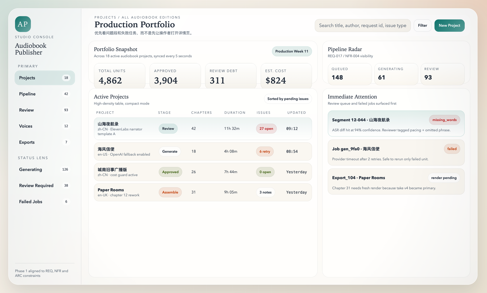
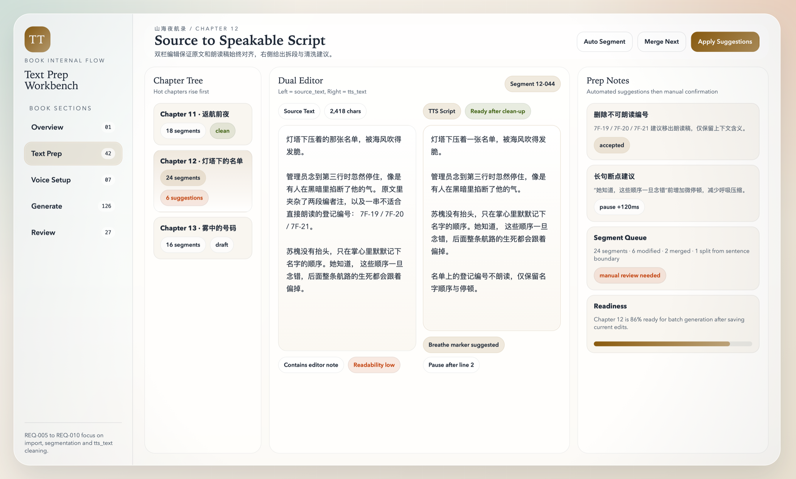
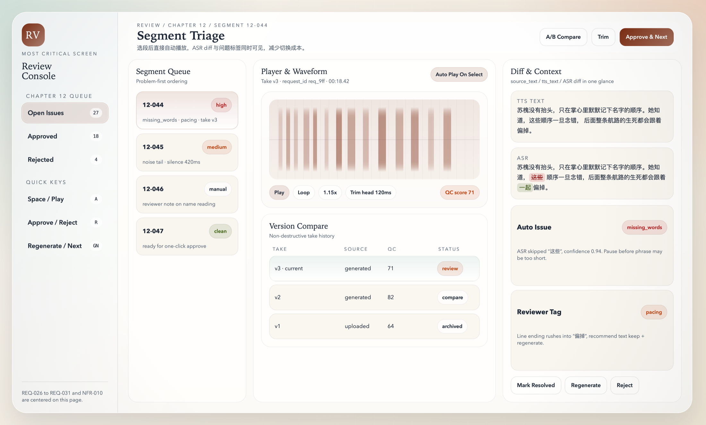

# AI Publisher Local Studio

本專案是一個面向 `audiobook / comic` 生產流程的本機版 Web Studio，目標是在一台 Mac 上先跑通完整內容生產閉環，並為後續 `motion_comic / video` 擴展預留統一的專案級模型設定。

它目前聚焦於單機 MVP：

- Web UI：登入、專案管理、有聲書流程、漫畫流程、審核、匯出
- Backend：FastAPI
- Database：SQLite
- Storage：本機檔案目錄
- Audio：macOS `say`，並已預留 `OpenAI / ElevenLabs` 真實 provider 接入

## 專案狀態

- 狀態：`MVP / Active Development`
- 目標：先穩定跑通本機端的 audiobook 工作台，並完成靜態漫畫 Phase 1 主流程
- 架構策略：模組化單體，不使用 Docker、Redis、獨立 Worker

## 主要能力

- 支援 `.txt / .md / .docx / .epub / .html / .xhtml` 文本匯入
- 自動拆章拆段
- `source_text / tts_text` 雙軌編輯
- 專案類型：`audiobook / comic / motion_comic / video`
- 聲線設定與段落級覆寫
- 角色設定：支援 `旁白 / 主角 / 配角 / 背景 / 自訂` 角色類型
- 角色可綁定具體小說人物名，並可解除角色綁定或解除聲線覆寫
- 文本準備頁支援按章人物自動識別與批量綁定聲線
- 文本準備頁支援多選連續段落後合併為一段
- 介面語言支援 `繁體中文 / 简体中文 / English / 日本語 / 한국어` 切換，預設為繁體中文
- 本機生成音訊
- Review Queue 與問題標記
- 章節渲染與 ZIP 匯出
- 漫畫 Phase 1：漫畫腳本、分鏡工作台、畫格生成、頁面排版
- 系統設定中的 `漫畫設定 / Video 設定`
- 本機 smoke test
- 可選接入 `OpenAI TTS / ASR`
- 可選接入 `ElevenLabs TTS / ASR`

## 畫面預覽

### 專案總覽



### 文本準備



### 審核工作台



## 目前流程

- 有聲書：
  `登入 -> 專案管理 -> 匯入文本 -> 拆章拆段 -> 人物識別 / 角色綁定 -> 編輯朗讀稿 -> 配置聲線 -> 生成音訊 -> 審核 -> 章節渲染 -> ZIP 匯出`
- 漫畫：
  `登入 -> 專案管理 -> 漫畫腳本 -> 分鏡工作台 -> 畫格生成 -> 頁面排版 -> 審核 -> 導出`

## 快速開始

### 環境需求

- macOS
- Python 3.11+
- 可使用系統指令 `say`
- 可使用系統指令 `afconvert`

### 啟動

```bash
git clone https://github.com/xuan139/ai-publisher-local-studio.git
cd ai-publisher-local-studio
chmod +x run_local.sh
./run_local.sh
```

啟動後開啟：

- [http://127.0.0.1:8000](http://127.0.0.1:8000)

預設登入帳號與角色：

- `admin@example.com / admin123`：管理員，完整流程與全部頁面
- `editor@example.com / editor123`：文本編輯，負責文本準備與生成
- `reviewer@example.com / review123`：審核員，只進入審核校對
- `delivery@example.com / delivery123`：交付管理，只進入匯出交付
- `settings@example.com / settings123`：設定管理，負責聲線、角色、漫畫與系統設定

其中 `admin@example.com / admin123` 保持不變。完整角色說明見：

- [預設角色帳號](docs/default_accounts.md)

介面語言：

- 預設為 `繁體中文`
- 可在登入頁右上角或登入後左側欄底部切換為 `简体中文 / English / 日本語 / 한국어`

### 回歸測試

```bash
.venv/bin/python scripts/smoke_test_local.py
```

該腳本會驗證：

`登入 -> 建立專案 -> 匯入文本 -> 生成 -> 審核通過 -> 章節渲染 -> ZIP 匯出`

## 真實 AI Provider

目前已接入：

- `OpenAI TTS / ASR`
- `ElevenLabs TTS / ASR`

如果未配置任何 API key，系統會自動回退到本機：

- `macOS say`
- 規則化 mock QC

## 漫畫與 Video 能力

目前不只是保存配置，已經落地了漫畫 Phase 1 的主流程頁面：

- `漫畫腳本`
- `分鏡工作台`
- `畫格生成`
- `頁面排版`

同時仍保留 `漫畫設定 / Video 設定` 兩組專案級配置：

- `漫畫設定`：劇本模型、分鏡模型、圖像模型、風格、色彩、比例、角色一致性
- `Video 設定`：腳本模型、鏡頭模型、圖像模型、影片模型、字幕模型、時長、動態風格

說明：

- `漫畫腳本 / 分鏡 / 畫格 / 排版` 已經有對應 SQLite 資料表與 API
- `漫畫設定 / Video 設定` 仍以配置保存與回顯為主
- 影片生成與動態漫畫時間軸尚未直接觸發實際生成任務

### 模型註冊表

現在模型選項已改成由 `YAML` 驅動，不再需要為每次新增模型改前後端程式碼。

- 註冊表檔案：`config/model_registry.yaml`
- 可調整內容：
  - Provider 清單與顯示名稱
  - OpenAI / ElevenLabs / macOS 的 TTS / ASR 模型與聲線列表
  - `漫畫設定 / Video 設定` 的預設值
  - `漫畫 / Video` 頁下拉框中可選的模型清單

修改完成後，重新啟動本機應用即可生效。

### 配置方式

```bash
cp .env.local.example .env.local
```

可配置項：

- `OPENAI_API_KEY`
- `ELEVENLABS_API_KEY`
- `AI_PUBLISHER_ASR_PROVIDER=auto|openai|elevenlabs|mock`

## 目錄結構

- `api/app/`：FastAPI 後端、資料庫初始化、文本處理、音訊處理、AI provider adapter
- `web/`：前端頁面與樣式
- `docs/`：需求文檔、功能手冊、安裝手冊
- `mockups/`：靜態畫面稿與 PNG
- `scripts/`：smoke test 等腳本
- `tools/`：文檔與 PDF 輔助工具

## 文檔

- [更新日誌](CHANGELOG.md)
- [預設角色帳號](docs/default_accounts.md)
- [一頁操作說明](docs/audiobook_one_page_guide.md)
- [一頁操作說明 Printable HTML](docs/audiobook_one_page_guide_print.html)
- [審核員一頁說明](docs/reviewer_one_page_guide.md)
- [審核員一頁說明 Printable HTML](docs/reviewer_one_page_guide_print.html)
- [本機安裝手冊](docs/local_install_manual.md)
- [需求文檔 REQ](docs/audiobook_platform_req.md)
- [Schema / API 設計](docs/audiobook_platform_schema_api.md)
- [Web 介面總覽](docs/audiobook_platform_web_overview.md)
- [漫畫流程設計草案](docs/comic_workflow_plan.md)
- [功能手冊 HTML](docs/audiobook_platform_function_manual.html)
- [系統架構草案](docs/publishing_platform_architecture.md)

## 協作規劃

本倉庫已初始化以下協作結構：

- Milestones
- 初始 Issues
- GitHub Issue Templates

用於跟蹤：

- Phase 1 MVP
- AI provider 接入
- UI / UX 打磨

## 授權

本倉庫採用自定義授權，詳見 [LICENSE](LICENSE)。

重點說明：

- 程式碼與原創文檔允許在授權條件下使用、修改與再分發
- 第三方 PDF 與外部參考材料不包含在該授權內
