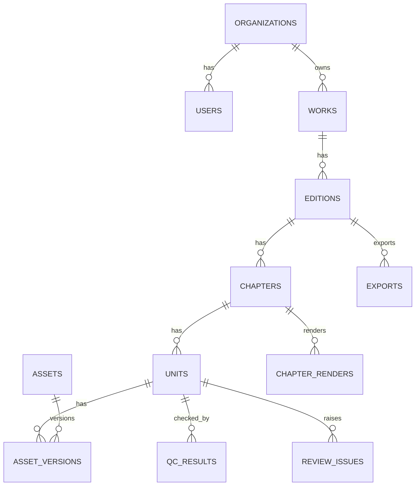

# Audiobook Phase 1 Schema And API Draft

## 1. 范围

本文档只覆盖第一阶段 `audiobook` 平台能力：

- 文本导入
- 拆章拆段
- narrator 级 TTS
- 段级版本
- 自动质检
- 章节渲染
- 导出

它是第一阶段的具体落地草案，但命名尽量兼容未来统一出版平台。

## 2. Phase 1 核心抽象

第一阶段虽然只做 audiobook，但建议已经使用统一出版平台中的部分抽象：

- `Work`
- `Edition`
- `Chapter`
- `Unit`
- `Asset`
- `AssetVersion`
- `Job`

在 Phase 1 中的具体映射为：

- `Edition.type = audiobook`
- `Unit.type = segment`
- `Asset.type = text/audio/waveform/transcript/chapter_render/export`

## 3. 数据表设计

## 3.1 organizations

| 字段 | 类型 | 说明 |
|---|---|---|
| id | uuid pk | 组织 id |
| name | varchar | 组织名称 |
| status | varchar | active/disabled |
| created_at | timestamptz | 创建时间 |

## 3.2 users

| 字段 | 类型 | 说明 |
|---|---|---|
| id | uuid pk | 用户 id |
| organization_id | uuid fk | 所属组织 |
| email | varchar unique | 邮箱 |
| name | varchar | 用户名 |
| role | varchar | admin/operator/reviewer |
| status | varchar | active/disabled |
| created_at | timestamptz | 创建时间 |
| updated_at | timestamptz | 更新时间 |

## 3.3 works

一个作品，对应一本书或一个 IP 项目。

| 字段 | 类型 | 说明 |
|---|---|---|
| id | uuid pk | 作品 id |
| organization_id | uuid fk | 所属组织 |
| title | varchar | 标题 |
| author | varchar | 作者 |
| language | varchar | 语言 |
| description | text | 简介 |
| cover_asset_id | uuid fk nullable | 封面资产 |
| status | varchar | draft/active/archived |
| metadata | jsonb | 扩展元数据 |
| created_by | uuid fk | 创建人 |
| created_at | timestamptz | 创建时间 |
| updated_at | timestamptz | 更新时间 |

## 3.4 editions

第一阶段固定 `type = audiobook`。

| 字段 | 类型 | 说明 |
|---|---|---|
| id | uuid pk | edition id |
| work_id | uuid fk | 所属作品 |
| type | varchar | audiobook |
| title | varchar | 版本名 |
| default_provider | varchar | elevenlabs/openai |
| default_voice_profile_id | uuid fk nullable | 默认 voice |
| status | varchar | draft/active/published |
| created_at | timestamptz | 创建时间 |
| updated_at | timestamptz | 更新时间 |

## 3.5 chapters

| 字段 | 类型 | 说明 |
|---|---|---|
| id | uuid pk | 章节 id |
| edition_id | uuid fk | 所属版本 |
| title | varchar | 章节标题 |
| order_index | int | 顺序 |
| source_text | text | 原始文本 |
| normalized_text | text | 清洗后文本 |
| status | varchar | draft/segmented/generating/reviewing/rendered/exported |
| created_at | timestamptz | 创建时间 |
| updated_at | timestamptz | 更新时间 |

索引建议：

- `(edition_id, order_index)`

## 3.6 units

第一阶段的 Unit 就是 Segment。

| 字段 | 类型 | 说明 |
|---|---|---|
| id | uuid pk | unit id |
| edition_id | uuid fk | 所属版本 |
| chapter_id | uuid fk | 所属章节 |
| unit_type | varchar | segment |
| order_index | int | 段顺序 |
| source_text | text | 原始段文本 |
| tts_text | text | 送去 TTS 的文本 |
| speaker_type | varchar | narrator |
| voice_profile_id | uuid fk nullable | 使用的 voice |
| status | varchar | draft/ready/queued/generating/review_required/approved/rejected |
| latest_asset_version_id | uuid fk nullable | 最新主音频版本 |
| text_hash | varchar | 文本 hash |
| created_at | timestamptz | 创建时间 |
| updated_at | timestamptz | 更新时间 |

索引建议：

- `(chapter_id, order_index)`
- `(status)`
- `(text_hash)`

## 3.7 voice_profiles

| 字段 | 类型 | 说明 |
|---|---|---|
| id | uuid pk | voice 配置 id |
| provider | varchar | elevenlabs/openai |
| provider_voice_id | varchar | voice id |
| model | varchar | 模型 |
| name | varchar | 显示名 |
| speed | numeric(4,2) | 语速 |
| style_preset | varchar | 风格 |
| instructions | text | 额外指令 |
| sample_asset_id | uuid fk nullable | 试听资产 |
| is_default | boolean | 是否默认 |
| created_by | uuid fk | 创建人 |
| created_at | timestamptz | 创建时间 |

## 3.8 pronunciation_rules

| 字段 | 类型 | 说明 |
|---|---|---|
| id | uuid pk | 规则 id |
| edition_id | uuid fk | 作用版本 |
| scope_type | varchar | global/chapter/unit |
| scope_id | uuid nullable | 作用对象 |
| target_text | varchar | 原始词 |
| replacement_text | varchar | 替换文本 |
| phonetic_hint | varchar | 发音提示 |
| active | boolean | 是否启用 |
| created_at | timestamptz | 创建时间 |

## 3.9 assets

平台中所有文件统一归一到 `assets`。

| 字段 | 类型 | 说明 |
|---|---|---|
| id | uuid pk | 资产 id |
| organization_id | uuid fk | 所属组织 |
| asset_type | varchar | text/audio/waveform/transcript/chapter_render/export |
| storage_key | text | 对象存储 key |
| mime_type | varchar | 文件类型 |
| size_bytes | bigint | 文件大小 |
| checksum | varchar | 校验和 |
| created_at | timestamptz | 创建时间 |

## 3.10 asset_versions

`units` 不直接指向文件，而是指向 `asset_versions`。

| 字段 | 类型 | 说明 |
|---|---|---|
| id | uuid pk | 版本 id |
| asset_id | uuid fk | 对应资产 |
| unit_id | uuid fk nullable | 所属 unit |
| version_no | int | 版本号 |
| source_kind | varchar | generated/edited/uploaded/rendered |
| request_id | varchar nullable | provider request id |
| duration_ms | int nullable | 音频时长 |
| loudness_lufs | numeric(5,2) nullable | 响度 |
| peak_db | numeric(5,2) nullable | 峰值 |
| silence_head_ms | int nullable | 头静音 |
| silence_tail_ms | int nullable | 尾静音 |
| metadata | jsonb | 扩展字段 |
| created_by | uuid fk | 创建人 |
| created_at | timestamptz | 创建时间 |

唯一约束建议：

- `(unit_id, version_no)`

## 3.11 qc_results

记录自动质检结果。

| 字段 | 类型 | 说明 |
|---|---|---|
| id | uuid pk | qc id |
| unit_id | uuid fk | 所属 unit |
| asset_version_id | uuid fk | 对应音频版本 |
| asr_text | text | ASR 回听文本 |
| diff_summary | jsonb | 差异摘要 |
| qc_score | numeric(5,2) | 质检分 |
| flags | jsonb | 问题标记 |
| created_at | timestamptz | 创建时间 |

## 3.12 review_issues

| 字段 | 类型 | 说明 |
|---|---|---|
| id | uuid pk | 问题 id |
| unit_id | uuid fk | 所属 unit |
| asset_version_id | uuid fk | 对应版本 |
| issue_type | varchar | pronunciation/pacing/missing_words/extra_words/noise/silence/style |
| severity | varchar | low/medium/high |
| source | varchar | auto/manual |
| description | text | 描述 |
| status | varchar | open/resolved/ignored |
| created_by | uuid fk nullable | 创建人 |
| created_at | timestamptz | 创建时间 |
| resolved_at | timestamptz nullable | 解决时间 |

## 3.13 jobs

| 字段 | 类型 | 说明 |
|---|---|---|
| id | uuid pk | 任务 id |
| job_type | varchar | import_text/split_chapter/generate_unit/run_qc/render_chapter/export_book |
| entity_type | varchar | work/edition/chapter/unit |
| entity_id | uuid | 对应实体 |
| provider | varchar nullable | provider |
| status | varchar | pending/running/succeeded/failed/cancelled |
| input_payload | jsonb | 输入 |
| output_payload | jsonb | 输出 |
| error_message | text | 错误 |
| retry_count | int | 重试次数 |
| created_by | uuid fk | 创建人 |
| started_at | timestamptz nullable | 开始时间 |
| finished_at | timestamptz nullable | 结束时间 |
| created_at | timestamptz | 创建时间 |

## 3.14 chapter_renders

| 字段 | 类型 | 说明 |
|---|---|---|
| id | uuid pk | 渲染 id |
| chapter_id | uuid fk | 所属章节 |
| asset_version_id | uuid fk | 章节音频版本 |
| render_version | int | 渲染版本 |
| duration_ms | int | 时长 |
| status | varchar | pending/running/succeeded/failed |
| created_by | uuid fk | 创建人 |
| created_at | timestamptz | 创建时间 |

## 3.15 exports

| 字段 | 类型 | 说明 |
|---|---|---|
| id | uuid pk | 导出任务 id |
| edition_id | uuid fk | 所属版本 |
| export_type | varchar | chapter_mp3/book_zip/report |
| asset_id | uuid fk nullable | 导出结果资产 |
| status | varchar | pending/running/succeeded/failed |
| metadata | jsonb | 扩展元数据 |
| created_by | uuid fk | 创建人 |
| created_at | timestamptz | 创建时间 |

## 4. 表关系



## 5. 状态流转

## 5.1 Chapter

`draft -> segmented -> generating -> reviewing -> rendered -> exported`

## 5.2 Unit

`draft -> ready -> queued -> generating -> review_required -> approved`

退回路径：

- `review_required -> rejected`
- `rejected -> ready`

## 5.3 Job

`pending -> running -> succeeded`

异常路径：

- `pending/running -> failed`
- `pending/running -> cancelled`

## 6. API 草案

Base URL：

`/api/v1`

## 6.1 Works / Editions

### POST `/works`

创建作品。

请求体：

```json
{
  "title": "示例作品",
  "author": "作者名",
  "language": "zh-CN"
}
```

### GET `/works`

获取作品列表。

### GET `/works/:workId`

获取作品详情。

### POST `/works/:workId/editions`

创建 edition。

请求体：

```json
{
  "type": "audiobook",
  "title": "标准旁白版",
  "defaultProvider": "elevenlabs"
}
```

### GET `/editions/:editionId`

获取 edition 详情。

## 6.2 导入与章节处理

### POST `/editions/:editionId/import`

导入文本文件并创建章节。

支持：

- `txt`
- `md`
- `docx`

### GET `/editions/:editionId/chapters`

获取章节列表。

### PATCH `/chapters/:chapterId`

更新章节标题、文本或顺序。

### POST `/chapters/:chapterId/split`

触发章节拆段。

请求体示例：

```json
{
  "strategy": "paragraph_then_sentence",
  "maxChars": 2800
}
```

## 6.3 Units

### GET `/chapters/:chapterId/units`

获取某章节的全部 segment。

查询参数：

- `status`
- `q`
- `hasIssues`

### PATCH `/units/:unitId`

更新 unit 的 `ttsText`、voice 或顺序。

```json
{
  "ttsText": "修订后的朗读稿",
  "voiceProfileId": "uuid",
  "status": "ready"
}
```

### POST `/units/:unitId/merge-next`

与下一段合并。

### POST `/units/:unitId/split`

按偏移或句边界拆分。

## 6.4 Voice Profiles

### GET `/voice-profiles`

获取可用 voice 列表。

### POST `/voice-profiles`

创建 voice profile。

### PATCH `/voice-profiles/:voiceProfileId`

更新 voice profile。

## 6.5 Generation

### POST `/units/:unitId/generate`

为单段发起 TTS。

```json
{
  "provider": "elevenlabs",
  "voiceProfileId": "uuid",
  "force": true
}
```

### POST `/chapters/:chapterId/generate`

为章节内全部 `ready` unit 批量生成。

### GET `/jobs`

查询任务列表。

### GET `/jobs/:jobId`

查询任务详情。

### POST `/jobs/:jobId/retry`

重试失败任务。

## 6.6 Asset Versions

### GET `/units/:unitId/asset-versions`

获取某段全部音频版本。

### GET `/asset-versions/:versionId`

获取单个音频版本详情。

### POST `/asset-versions/:versionId/set-primary`

将某个版本设为当前主版本。

### POST `/asset-versions/:versionId/trim`

记录非破坏性裁剪参数。

```json
{
  "trimHeadMs": 120,
  "trimTailMs": 160
}
```

## 6.7 QC 与 Review

### POST `/units/:unitId/qc`

触发单段自动质检。

### GET `/units/:unitId/qc-results`

获取 QC 结果。

### GET `/units/:unitId/issues`

获取问题列表。

### POST `/units/:unitId/issues`

人工创建问题。

### PATCH `/issues/:issueId`

更新问题状态。

### POST `/units/:unitId/approve`

将当前段标记为通过。

### POST `/units/:unitId/reject`

将当前段退回修改。

## 6.8 Chapter Render

### POST `/chapters/:chapterId/render`

将已通过段落拼接成章节音频。

### GET `/chapters/:chapterId/renders`

获取章节渲染历史。

## 6.9 Export

### POST `/editions/:editionId/export`

导出整本书。

```json
{
  "exportType": "book_zip"
}
```

### GET `/exports/:exportId`

获取导出任务状态。

## 7. 后台任务建议

Worker 任务建议拆分为：

- `import_text_job`
- `normalize_chapter_job`
- `split_chapter_job`
- `generate_unit_audio_job`
- `run_asr_job`
- `run_qc_job`
- `render_chapter_job`
- `export_edition_job`

## 8. 对象存储命名建议

- `works/{workId}/editions/{editionId}/units/{unitId}/audio/v{n}.mp3`
- `works/{workId}/editions/{editionId}/units/{unitId}/waveform/v{n}.json`
- `works/{workId}/editions/{editionId}/chapters/{chapterId}/render/v{n}.mp3`
- `works/{workId}/editions/{editionId}/exports/{exportId}.zip`

## 9. 幂等建议

生成类任务的幂等 key：

`unit_id + text_hash + voice_profile_id + provider + model`

## 10. 演进兼容性

虽然第一期只做 audiobook，但以下设计已为未来留口：

- `editions.type` 不写死
- `units.unit_type` 不写死
- `assets.asset_type` 可扩展
- `jobs.job_type` 可扩展

以后扩展 comic / video / SBS 时，不需要重做数据库主框架，只需要增加：

- 新的 edition type
- 新的 unit type
- 新的 asset type
- 新的 render job
