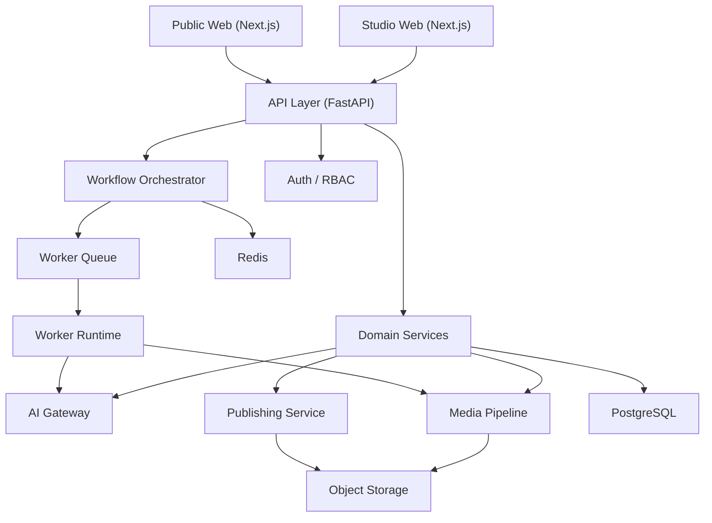
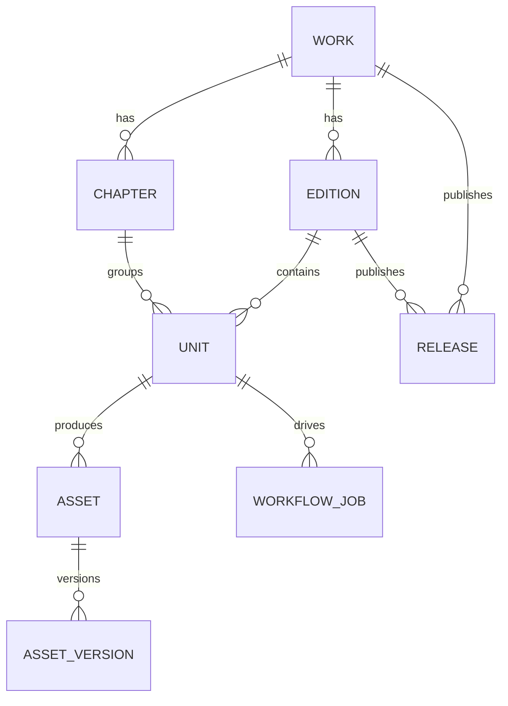
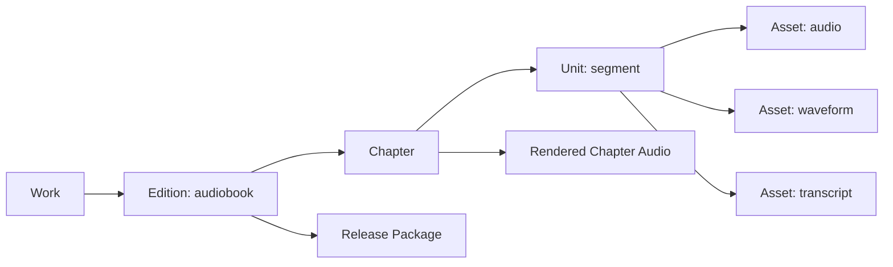
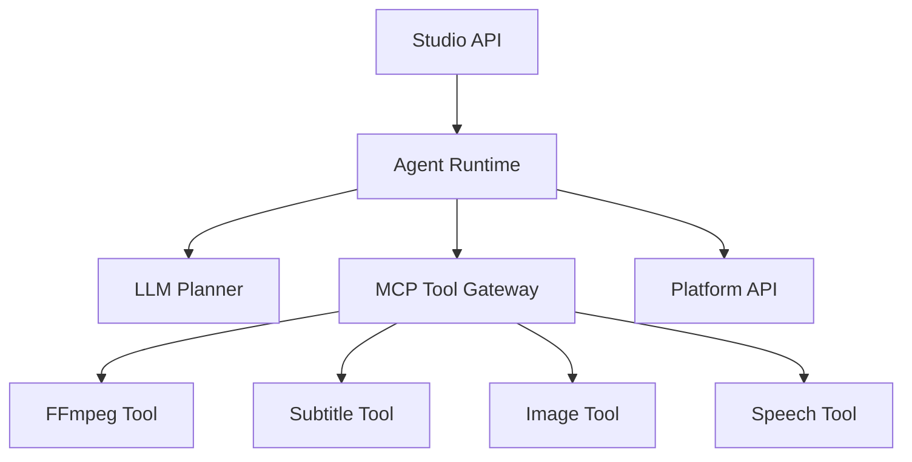

# Unified Publishing Platform Architecture

## 1. 目标

平台最终目标不是单一的 audiobook 工具，而是一个统一的 AI 出版平台，未来可持续扩展到：

- audiobook
- comic
- video
- SBS content

第一阶段从 audiobook 切入，但从第一天起，架构要保证后续新增内容形态时不需要推翻重做。

## 2. 核心原则

### 2.1 统一作品模型

平台统一围绕以下核心对象建模：

- `Work`
- `Edition`
- `Chapter`
- `Unit`
- `Asset`
- `AssetVersion`
- `WorkflowJob`
- `Release`

说明：

- `Work` 表示一个作品或 IP
- `Edition` 表示作品的一种出版形态
- `Unit` 表示某个出版形态下的最小生产单元
- `Asset` 表示实际文件
- `AssetVersion` 表示某个文件的版本

### 2.2 先做模块化单体

第一阶段不做微服务。  
采用：

- 一个主 API 服务
- 一个 Worker 服务
- 一个统一前端 Studio
- 一个统一对象存储

业务模块内部清晰拆分，但部署保持简单。

### 2.3 AI 与业务解耦

业务代码不直接耦合：

- ElevenLabs
- OpenAI
- Seedream
- Seedance
- Veo

所有模型调用统一通过 `AI Gateway`。

### 2.4 MCP 是工具层，不是业务层

MCP 或 Agent Runtime 用来编排工具，不用来承载核心业务流程。

核心业务状态仍由平台自己的 API 和数据库控制。

## 3. 推荐技术方向

## 3.1 前端

### Studio 内部生产后台

- `Next.js`
- `TypeScript`
- `TanStack Query`
- `Zustand`
- `Tailwind CSS`
- `shadcn/ui`

### Public 对外出版站

- `Next.js`
- `TypeScript`

理由：

- Studio 和 Public 都可复用 React 组件、设计系统和路由能力
- Next.js 适合同时做后台和公开内容页
- 后续 SEO、作品详情页、试听页、试看页都更顺

## 3.2 后端

- `FastAPI`
- `PostgreSQL`
- `Redis`
- `S3-compatible storage`
- `FFmpeg`
- `Celery` 或 `Arq`

理由：

- FastAPI 适合 AI、媒体处理、异步任务、工具编排
- PostgreSQL 足够承载前中期复杂内容生产关系
- Redis 用于队列、缓存、状态协作
- FFmpeg 是音频/视频处理基础设施

## 4. 平台分层



## 5. 核心模块

## 5.1 Studio Web

内部人员使用的生产后台。

负责：

- 导入内容
- 编辑文本
- 批量生成
- 校对和审核
- 查看成本
- 发布导出

## 5.2 Public Web

面向最终用户的出版站。

负责：

- 作品浏览
- 章节访问
- 试听试看
- 已发布内容播放
- 后续购买、订阅、收藏

## 5.3 API Layer

负责：

- 鉴权
- 组织 / 项目 / 作品管理
- 内容读写
- 任务创建
- 状态查询
- 审核与发布接口

建议结构：

- `/studio/*` 内部生产接口
- `/public/*` 对外内容接口
- `/internal/*` Worker 和系统回调接口

## 5.4 Domain Services

建议拆为以下业务模块：

- `identity`
- `catalog`
- `content_ingest`
- `edition_management`
- `workflow`
- `asset_management`
- `quality_control`
- `review_and_release`
- `provider_registry`
- `cost_tracking`

## 5.5 AI Gateway

AI Gateway 统一封装不同 provider 的调用方式。

职责：

- provider adapter
- 参数标准化
- prompt 模板版本管理
- request id 记录
- 成本统计
- fallback 路由

示例：

- `generate_audio_unit()`
- `transcribe_audio()`
- `generate_image_panel()`
- `generate_video_shot()`
- `generate_sbs_scene()`

## 5.6 Media Pipeline

Media Pipeline 不负责“理解内容”，只负责“处理文件”。

职责：

- 文本切分
- 音频拼接
- 波形图生成
- loudness 检查
- 字幕生成
- 图片合成
- 视频转码
- SBS 资产打包

## 5.7 Worker Runtime

所有长任务都异步执行：

- TTS 生成
- ASR 回听
- QC 分析
- 章节渲染
- 视频转码
- 图像批量生成
- 发布包导出

不要把这些任务放在 HTTP 请求里同步执行。

## 5.8 Publishing Service

负责：

- release 管理
- 发布版本冻结
- public metadata 生成
- 内容可见性控制
- 公开访问地址生成

## 6. 统一数据模型



### Work

一个作品或 IP。

### Edition

作品的一种出版形态：

- `audiobook`
- `comic`
- `video`
- `sbs`

### Unit

某一形态的最小生产单元。

示例：

- audiobook -> `segment`
- comic -> `panel`
- video -> `shot`
- sbs -> `stereo_scene`

### Asset

所有输出文件统一归一：

- `text`
- `audio`
- `image`
- `video`
- `subtitle`
- `manifest`
- `metadata`

## 7. 第一阶段 audiobook 在统一模型中的映射



第一阶段只实现：

- `Edition = audiobook`
- `Unit = segment`
- `Asset = audio / waveform / transcript / render`

但表结构和服务命名不写死在 `segment-only` 模型里。

## 8. Agent 与 MCP 的位置



### Agent 适合做的事

- 自动拆章拆段
- 朗读稿清洗
- 发音规则建议
- 漫画分镜提炼
- 视频 shot list 提炼
- 自动质检建议

### Agent 不应该直接做的事

- 绕过平台 API 直接改核心数据
- 绕过审核直接发布
- 持久化最终生产状态

正确模式：

`Agent 生成建议 -> 人工确认或 Workflow 接受 -> 通过平台 API 持久化`

## 9. 推荐部署形态

## 9.1 第一阶段

- `studio-web`
- `api`
- `worker`
- `postgres`
- `redis`
- `object storage`

这是最稳的起步组合。

## 9.2 第二阶段

当漫画、视频、SBS 增加后，再考虑：

- 增加 `gpu-worker`
- 增加 `transcode-worker`
- 增加 `agent-worker`

但仍可保持逻辑统一。

## 10. Monorepo 建议

```text
platform/
  apps/
    studio-web/
    public-web/
  services/
    api/
    worker/
  libs/
    domain/
    ai_gateway/
    media_pipeline/
    agent_runtime/
    mcp_tools/
  infra/
    docker/
    scripts/
    migrations/
  docs/
```

如果前期想更轻一点，也可以先：

```text
platform/
  web/
  api/
  worker/
  docs/
```

## 11. 演进路线

### Phase 1

只做 audiobook：

- 文本导入
- 拆章拆段
- TTS
- ASR QC
- 校对
- 导出

### Phase 2

扩展 comic：

- 新增 `Edition = comic`
- 新增 `Unit = panel`
- 新增 image generation 和排版

### Phase 3

扩展 video：

- 新增 `Edition = video`
- 新增 `Unit = shot`
- 新增视频渲染和字幕

### Phase 4

扩展 SBS：

- 新增 `Edition = sbs`
- 新增 `Unit = stereo_scene`
- 新增双目资源、深度和设备配置

## 12. 一句话结论

最稳的技术方向是：

- 前端：`Next.js`
- 后端：`FastAPI`
- 异步：`Celery/Arq + Redis`
- 存储：`PostgreSQL + S3-compatible storage`
- 媒体：`FFmpeg`
- AI：统一 `AI Gateway`

并以 `Work / Edition / Unit / Asset / Release` 为核心模型，从 audiobook 起步，后续平滑扩展到漫画、视频和 SBS。
